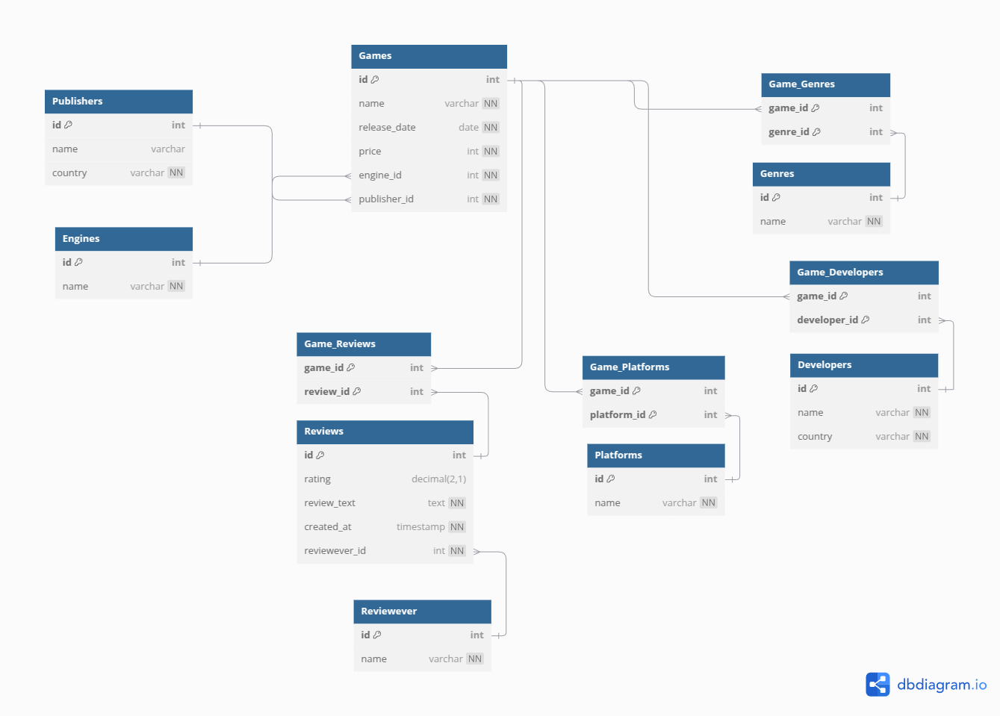

# Database schema

# Project desciption
This project is a simple RESTAPI made with **C#, ASP.NET Core and Entity Framework Core.**
It uses simple CRUD operations on the database. 

This project follows a generic repository pattern using C# generics. Instead of writing separate CRUD operations for each entity, a single Repository<T> class is used to handle operations for most of the database tables.

## Swagger 

### Tables creation
Can be found here: [tablesCreation.sql](GameAPI/GameAPI/Schema/tablesCreation.sql)

